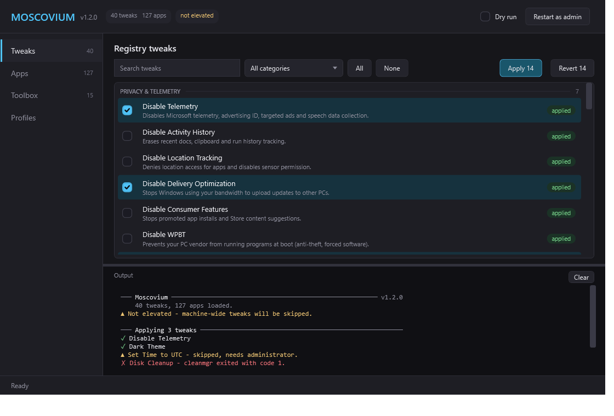

# Moscovium CLI

The command-line companion to [Moscovium](https://github.com/Moscoviumdebloat/Moscovium),
the Windows debloat and setup toolbox. Same tweaks, same app catalog, and a
window when you want one - all from a single line on a machine you just
finished installing.

```powershell
irm https://raw.githubusercontent.com/Moscoviumdebloat/Moscovium-CLI/main/moscovium.ps1 | iex
```

That drops you into an interactive menu. Nothing is installed, nothing is
downloaded to disk, and no .NET runtime is required — Windows PowerShell 5.1,
which ships with Windows, is enough.

---

## What it does

| | |
|---|---|
| **One-click debloat box** | The landing page in the window and the first entry in the menu. Six steps behind one prompt: WinUtil preset, Win11Debloat preset, security-only Windows Update, TCP autotuning, CPU priority, dynamic tick. |
| **Task manager** | btop-shaped: CPU with per-core bars and history, memory, disk, network, and a sortable process list you can end a process from. |
| **Search apps** | One query across winget, Chocolatey and Scoop, with install from whichever one has it. |
| **Package managers** | Install Chocolatey or Scoop from their own install scripts, with winget status alongside. |
| **Customization** | The desktop app's shell replacements - Open-Shell, Nilesoft Shell, StartAllBack, ExplorerPatcher - each fetched from its vendor's current release. |
| **40 tweaks** | Privacy & telemetry, Explorer & taskbar, gaming & performance, hardware, advanced. Applied, reverted, or reported on. |
| **127 apps** | The full curated winget catalog, plus direct-download and archive installers, across 8 categories. |
| **16 toolbox actions** | WinUtil, Win11Debloat, Windows Update policy, TCP autotuning, dynamic tick, CPU priority, and the classic control panels - each on its own, when you do not want the whole box. |
| **6 guides** | The manual walkthroughs - BIOS, GPU control panels, network - that no tool can do for you. |
| **App store** | Community releases from the Moscovium dev orgs on GitHub. |
| **Personalise** | The desktop app's six cursor packs, fetched on demand, plus your own, and wallpaper. |
| **Counter-Strike** | A page per game, as the desktop app has: configs and launch options for CS2 and for CS:GO. |
| **Profiles** | Setup checklists, interchangeable with the desktop app's. |
| **Two front-ends** | The same engine drives a terminal UI and a window. `-Gui` opens the window. |

Everything in the tweak and app catalogs is generated directly from the GUI's C#
source, so the two stay in step. See [Keeping up with the GUI](#keeping-up-with-the-gui).

## Two things the desktop app does not do

**Revert.** Before writing anything, the CLI records the prior state of every
registry value it is about to touch — the old value and type, or the fact that
it did not exist, or that its key did not exist. That snapshot goes to
`%LOCALAPPDATA%\Moscovium\backups\`, and `-Revert` replays it: old values
restored, values it introduced deleted, and keys it created removed if they end
up empty again.

```powershell
.\moscovium.ps1 -Apply "Dark Theme"
.\moscovium.ps1 -Revert "Dark Theme"     # exactly back to how it was
```

The four action tweaks — Disk Cleanup, Remove Temp Files, Create Restore Point —
are one-shot and say so. High Performance Power Plan is the exception: it records
the previously active scheme, so it does revert.

**Dry run.** `-DryRun` prints every registry write it would make, then makes
none of them.

```powershell
.\moscovium.ps1 -Apply "Privacy & Telemetry" -DryRun
```

## GUI

`moscovium.ps1 -Gui` opens a window. It is the same file, the same catalogs and
the same engine - not a second implementation.



```powershell
irm <url> | iex                                    # menu, then pick GUI
& ([scriptblock]::Create((irm <url>))) -Gui        # straight to the window
.\moscovium.ps1 -Gui
```

The theme is AMOLED: the canvas is true black, so those pixels are simply off on
an OLED panel, and surfaces lift off it in near-black purples rather than greys.

Rows are grouped by category with a count per group, ticking one tints the whole
row, the action buttons say how many are selected and disable when none are, and
the sidebar carries the size of each page. Ctrl+F jumps to the search box on the
current page; Escape clears it.

Every button calls the function the CLI calls: `Invoke-Tweaks`,
`Invoke-AppInstall`, `Invoke-ToolboxAction`, `Invoke-SetupProfile`. What makes
that possible is three optional sinks on the shared context - `Sink`,
`ProgressSink` and `ConfirmSink`. Leave them unset and output goes to the
console; the window sets them, and the identical engine calls end up in the log
pane, the progress bar and modal dialogs instead. There is a test that fails if
the GUI ever grows its own registry writes or winget calls.

It uses WPF, which ships with .NET Framework, so there is still nothing to
install and it still works straight from `irm`. Two consequences worth knowing:

- **WPF needs an STA thread.** `powershell.exe` is STA; `pwsh` is not. Started
  from `pwsh`, the GUI relaunches itself in an STA host rather than failing.
- **Long work runs on the UI thread**, pumping the dispatcher between items, so
  the window keeps painting and the action buttons disable while it runs. It is
  cooperative rather than a background runspace - honest about what it is.

**It is always elevated.** Nearly every tweak writes to `HKLM`, so a
non-elevated window would show a catalog it mostly cannot apply. `-Gui` requests
elevation up front and reopens itself; there is no in-app "restart as admin"
button to explain, and no permanently red "not elevated" badge to ignore.

The one exception is `-Gui -DryRun`, which opens without a UAC prompt, because a
dry run writes nothing and demanding elevation to preview a plan would be
theatre. The header carries a DRY RUN badge so the two are never confused.

## Usage

### Interactive

```powershell
irm <url> | iex          # menu
.\moscovium.ps1          # same, from a local copy
```

Arrow keys move, space toggles, `/` filters, enter confirms, escape goes back.
In a host that cannot read individual keypresses — a redirected stdin, ISE,
`-NonInteractive` — it falls back to numbered prompts rather than failing.

### With arguments

`iex` cannot pass arguments, so use the script-block form:

```powershell
& ([scriptblock]::Create((irm <url>))) -Status
& ([scriptblock]::Create((irm <url>))) -Apply "Privacy & Telemetry" -Yes
```

Or download once and run it as a normal script.

### Tweaks

```powershell
.\moscovium.ps1 -Status                              # what is applied right now
.\moscovium.ps1 -Apply "Disable Telemetry"           # by exact name
.\moscovium.ps1 -Apply "Explorer & Taskbar"          # by category
.\moscovium.ps1 -Apply "Disable *"                   # by wildcard
.\moscovium.ps1 -Apply all -Yes                      # everything, no prompts
.\moscovium.ps1 -Revert "Dark Theme"
```

Names, categories, wildcards, bare substrings and `all` are interchangeable
everywhere. Anything that matches nothing is reported rather than skipped
silently.

### Apps

```powershell
.\moscovium.ps1 -Install 7zip.7zip
.\moscovium.ps1 -Install Browsers                    # a whole category
.\moscovium.ps1 -Install "VLC*",Discord,Git.Git      # mix and match
.\moscovium.ps1 -UpgradeAll                          # winget upgrade --all
.\moscovium.ps1 -VCRuntimes                          # all VC++ redistributables
```

### One click

```powershell
.\moscovium.ps1 -Toolbox oneclick
```

Or open the window and press the button - it is the page you land on:

```powershell
.\moscovium.ps1 -Gui
```

### Tasks

```powershell
.\moscovium.ps1 -Tasks
```

CPU with per-core bars and a history graph, memory, disks, network, and the
process list underneath. `c` `m` `p` `n` sort it, `/` filters, `space` freezes
it, `k` ends the process under the cursor. In the window it is the second page
in the sidebar.

With output redirected it prints one snapshot instead of repainting a frame
nobody can see, so `-Tasks > tasks.txt` is useful rather than a hang.

### Search apps

```powershell
.moscovium.ps1 -FindApp neovim
.moscovium.ps1 -FindApp 7zip -FindIn choco,scoop
```

One query, three managers, in the window as its own page and in the menu as
**Search apps**. Each is reached the only way it actually can be:

| | how | note |
|---|---|---|
| winget | its CLI | no machine-readable output for `search`, so the table is parsed |
| Chocolatey | the community feed | works without Chocolatey installed |
| Scoop | the official `main` and `extras` bucket listings | works without Scoop installed; no version column |

**The table parsing is locale-proof.** winget has no `--output json` for
`search` (checked on 1.29), so column boundaries come from the header's
spacing rather than from column names - a Spanish install prints
`Nombre  Id  Version  Coincidencia`. Slicing by position also keeps names with
spaces in one piece: `Advanced Archive Password Recovery` is one field.

Two things that bit during development and now have tests: when `--count`
truncates, winget prints a notice *below* the table which parsed into a result
whose id read `entries truncated due` - a winget id never contains whitespace,
which is the rule that drops it without matching localised wording. And
Chocolatey's feed has no `d:Id` property at all: the package id is the Atom
`<title>`, while `d:Title` is the human name.

Scoop results carry no version - a bucket listing is file names, and fetching
4000 manifests to fill one column is not a trade worth making. Installing from
`extras` runs `scoop bucket add extras` first, since it is not added by
default.

Installing goes through each manager: winget through the same path as the app
catalog, Chocolatey and Scoop through their own CLIs, which have to be
installed first and want opposite privileges - see below.

### Package managers

```powershell
.\moscovium.ps1 -List packages          # what is installed
.\moscovium.ps1 -InstallManager choco   # Chocolatey
.\moscovium.ps1 -InstallManager scoop   # Scoop
```

In the window it is its own sidebar page.

**The two want opposite privileges, and both enforce it.** Chocolatey installs
machine-wide to `%PROGRAMDATA%\chocolatey` and needs administrator. Scoop
installs per-user to `~\scoop` and its installer *refuses* to run elevated —
`Running the installer as administrator is disabled by default` — unless passed
`-RunAsAdmin`, which turns it into a machine-wide install.

Moscovium's window is always elevated, and a child process inherits that with
no reliable way to drop it. So installing Scoop from the window offers the
machine-wide variant its own docs describe, and hands you the one-line command
to paste into an ordinary PowerShell window if that is not what you wanted.
From an unelevated CLI it just installs.

Each install command is stored verbatim from that project's own install page
rather than rebuilt from parts — someone else's installer invocation is not
ours to improve, and printing the exact line you would paste is the point of
showing it. winget is listed for its status only: it arrives with App Installer
from the Microsoft Store, and scripting around the Store is the kind of thing
that breaks on the next Windows build.

### Customization

```powershell
.\moscovium.ps1 -List customization
.\moscovium.ps1 -Customize openshell
.\moscovium.ps1 -Customize explorerpatcher
```

The desktop app's Customization page: Open-Shell, Nilesoft Shell, StartAllBack
and ExplorerPatcher. It bundles their installers as binaries; a single script
cannot, so each is fetched from where its vendor publishes it *today* - the
latest GitHub release for Open-Shell and ExplorerPatcher, nilesoft.org's
download page for Shell, startallback.com's download link for StartAllBack -
and run as the vendor ships it, after the link is shown and confirmed. In the
window it is its own sidebar page.

**The vendor channel, not winget, and that was measured.** All four have winget
packages, but winget's ExplorerPatcher was `22631.5335.68.2` when GitHub's
latest was `26100.8457.70.3`. ExplorerPatcher is tied to the Windows build -
22631 is 23H2, 26100 is 24H2 - and installing the stale one on a newer Windows
is exactly the failure it is notorious for. What each vendor currently
publishes is also what the desktop app bundles.

The desktop page's fifth button, the StartAllBack trial reset, is not here.
It circumvents licensing, the same reason MAS is not in the catalog.

### Personalise

```powershell
.\moscovium.ps1 -List cursors
.\moscovium.ps1 -Cursor material-dark          # one of the desktop app's six packs
.\moscovium.ps1 -Cursor C:\my-cursors           # your own folder of .cur / .ani
.\moscovium.ps1 -Cursor default                 # back to Windows
.\moscovium.ps1 -Wallpaper C:\pic.jpg -WallpaperStyle Fit
.\moscovium.ps1 -CsConfig yabosen               # or a path to your own .cfg
```

Also a Personalise screen in the menu.

The desktop app's three cursor packs are 345 files - too much to carry in a
single script. So a preset is fetched when you pick it: the seventeen files
Windows has roles for, straight from the desktop app's own repository, then
applied and registered under Mouse Properties exactly as the desktop app does.
Cursors are per-user and `-Cursor default` puts them back.

### Counter-Strike

A page per game in the window and a screen per game in the menu, the way the
desktop app splits them - because the two differ in more than the title:

|  | CS2 | CS:GO |
|---|---|---|
| cfg folder | `...\Counter-Strike Global Offensive\game\csgo\cfg` | `...\Counter-Strike Global Offensive\csgo\cfg` |
| launch options | `-high -novid -allow_third_party_software -tickrate 128 -noaafonts` | `-tickrate 128 -allow_third_party_software +exec autoexec -freq 180` |
| yabosen.cfg | yes | not offered - it is a CS2 config |

The CS2 update moved cfg down into `game\csgo\`; the legacy CS:GO depot still
uses the original path. The desktop app searches the CS2 path for both of its
pages, so its CS:GO page writes into the CS2 folder - here each page looks in
its own place.

```powershell
.\moscovium.ps1 -CsConfig yabosen        # CS2, from Yabosen/YabosenCFG
.\moscovium.ps1 -CsConfig C:\my.cfg      # into every CS2 cfg folder found
```

### Toolbox

The individual actions, for when you want fewer than all six.

```powershell
.\moscovium.ps1 -List toolbox
.\moscovium.ps1 -Toolbox winutil-preset
.\moscovium.ps1 -Toolbox updates-security
.\moscovium.ps1 -Toolbox network-better
```

### Profiles

```powershell
.\moscovium.ps1 -Profile .\my-setup.json
.\moscovium.ps1 -Apply "Privacy & Telemetry" -Install Browsers -SaveProfile .\my-setup.json
```

Profiles use the same JSON shape as the desktop app's `SetupProfile`, so one
saved in the GUI runs here and vice versa.

### Everything else

```powershell
.\moscovium.ps1 -Help
.\moscovium.ps1 -List tweaks | apps | toolbox | backups | categories
.\moscovium.ps1 -Search hibernation
```

| Flag | |
|---|---|
| `-DryRun` | print the plan, change nothing |
| `-Yes` | skip confirmations |
| `-Gui` | open the graphical interface |
| `-Elevate` | relaunch elevated immediately |
| `-NoColor` | plain output |
| `-Ascii` | ASCII glyphs instead of box drawing |
| `-NoBanner` | skip the banner |

## How it looks

```
   __  __                                   _
  |  \/  |  ___   ___   ___   ___  __   __ (_) _   _  _ __ ___
  | |\/| | / _ \ / __| / __| / _ \ \ \ / / | || | | || '_ ` _ \
  | |  | || (_) |\__ \| (__ | (_) | \ V /  | || |_| || | | | | |
  |_|  |_| \___/ |___/ \___| \___/   \_/   |_| \__,_||_| |_| |_|

  ──────────────────────────────────────────────────────────────────────────────
  v1.2.0   ·   40 tweaks   ·   127 apps   ·   ● elevated
  ──────────────────────────────────────────────────────────────────────────────

  ─── Privacy & Telemetry ────────────────────────────────────────────────── 6/7
  ◉ Disable Telemetry                             applied
  ◉ Disable Activity History                      applied
  ○ Set Time to UTC

    NVIDIA App  ███████████░░░░░░░░░░░░░░░   42%   87.4 MB / 208.0 MB   8.5 MB/s
```

Everything degrades. On a console that cannot render box drawing the same
screens come out as `---`, `[x]`, `[ ]` and `#`, which is what a fresh Windows
install in legacy conhost gets. `-Ascii` forces that mode; `-NoColor` drops
colour too.

There are no ANSI escape sequences anywhere — legacy conhost does not process
them by default, and a debloat tool is exactly what people run on a machine in
that state. The selection bar, the status colours and the banner gradient are
all built from Write-Host's sixteen colours, which behave identically in conhost
and Windows Terminal.

## Elevation

Most tweaks write to `HKLM` and need administrator rights. Run the CLI from an
elevated prompt, or let it relaunch itself — it will offer, and rebuild your
exact invocation for the elevated child. When it was piped from the network,
the child re-fetches the same URL, so pin that URL if you care.

Unelevated, per-user (`HKCU`) tweaks still apply; the rest are reported as
skipped rather than silently failing.

## Layout

```
moscovium.ps1     the built single-file bundle - this is what irm fetches
build.ps1         bundles src/ + data/ into it
VERSION

src/              function libraries, concatenated in name order
  00-Core         context, output sinks, prompting, elevation
  01-Catalog      catalog loading and name resolution
  05-Theme        terminal capabilities, glyphs, rules, progress
  10-Registry     registry read/write, snapshots, backups
  20-Tweaks       apply, revert, status
  30-Apps         winget, download, zip and script installs
  40-Toolbox      one-shot actions
  50-Profile      setup profiles
  52-Tasks        task manager sampling
  54-Packages     package manager detection and install
  56-Customize    shell replacements from their vendors' release channels
  58-AppSearch    one search across winget, Chocolatey and Scoop
  60-Menu         interactive selectors and screens
  65-TaskView     task manager, console front-end
  70-Gui          the WPF window
  90-Main         argument dispatch

data/             generated catalogs and gui.xaml, embedded at build time
tools/            Sync-Catalog.ps1 and the C# literal parser it uses
tests/            Run-Tests.ps1
deploy/           Cloudflare Worker for the short irm URL
```

`moscovium.ps1` is generated. Edit `src/` and run `./build.ps1`.

### Why a bundle

`irm <url> | iex` has nowhere to put a second file, so everything — the two JSON
catalogs included — is embedded in one script.

`iex` also runs its input in the **caller's** scope. A bare concatenation would
leave sixty-odd functions, a `$Ctx` variable and a modified
`$ErrorActionPreference` sitting in the user's session afterwards. So the bundle
wraps itself in a script block and invokes that; the run gets its own scope and
leaves nothing behind. There is a test for it.

## Building and testing

```powershell
./build.ps1            # regenerate moscovium.ps1
./build.ps1 -Check     # fail if it is stale (CI)
./tests/Run-Tests.ps1
```

The suite covers catalog integrity, name resolution, the registry engine, the
apply/revert round-trip, the theme, menu geometry, profiles, the GUI and the
bundle itself. The registry tests write only to
`HKCU\Software\MoscoviumCliTest`, which they create and remove; no real system
setting is touched.

Two things to expect while it runs:

- A minimised PowerShell window appears for about twelve seconds. That is the
  GUI smoke test launching the **built bundle** with `-Gui`. It has to be the
  bundle rather than `src/`, because the bundle wraps everything in `& { ... }`
  and that scope difference is real: it is where a working GUI and a broken one
  diverge. Run the suite under `powershell.exe`, not `pwsh` — WPF needs STA, and
  the three window-construction tests skip on an MTA host.
- The registry tests briefly create and delete their scratch key.

## Keeping up with the GUI

`tools/Sync-Catalog.ps1` reads `Models/AppTweak.cs` and `Models/SetupProfile.cs`
from the GUI repo and regenerates `data/tweaks.json` and `data/apps.json`. Run it
after the GUI's catalogs change:

```powershell
./tools/Sync-Catalog.ps1                      # clones the GUI repo
./tools/Sync-Catalog.ps1 -GuiPath ../Moscovium # or use a local checkout
./build.ps1
./tests/Run-Tests.ps1
```

The generated files record which GUI commit they came from.

## What came across from the desktop app

Everything except the parts that cannot live in a single script:

| Desktop app | Here |
|---|---|
| Tweaks, App Store, Optimizations, Toolbox, Legacy Menus | ported |
| Guides, CS2/CS:GO configs, Settings | ported |
| Cursors | ported - the six packs are fetched from the desktop app's repository on demand (seventeen files each), or point it at your own folder. |
| Wallpaper | ported |
| Customization page installers | ported - fetched from each vendor's current release channel instead of bundled as binaries. The trial reset is not. |

## Not ported from the GUI

Two catalog entries are deliberately absent: the **MAS activation** bootstrap and
the **StartAllBack trial reset**. Both exist to circumvent licensing. Everything
else on the GUI's Optimizations, Toolbox, Customization and Legacy Menus pages is
here. The exclusion is one list in `tools/Sync-Catalog.ps1` if you disagree.

Nothing else on those pages is missing. The cursor packs and the Customization
installers are fetched from their sources at apply time rather than bundled,
which is the only way binaries fit in a single script.

## Third-party scripts

WinUtil, Win11Debloat and any catalog entry with a `scriptUrl` run code published
by someone else. The CLI shows the URL *and the exact command* and asks first,
every time. It does not pin or review their contents — nor does the GUI.

The prompt defaults to yes, so Enter runs it. The window closes as soon as you
quit the tool; it only stays open if the script fails outright, so an error like
a bad parameter is still readable instead of flashing past. The CLI waits and
returns to what you were doing once the window closes.

They are launched as `irm <url> | iex` in a **separate PowerShell process**, not
executed inside the CLI. That matters:

- This bundle runs under `Set-StrictMode -Version Latest` and
  `$ErrorActionPreference = 'Stop'`, and child scopes inherit both. A
  15,000-line WPF script is not written to survive either.
- WinUtil calls a bare `break` when it self-elevates, which in-process would
  unwind whatever loop the CLI was running, including the menu.
- WinUtil is a WPF app and wants its own host and console.

**On `winutil-preset`:** current WinUtil takes `-Config`, `-Preset` and
`-Offline`. There is no `-Run`, and `-Config` only *preselects* tweaks in the
GUI — you still press Run Tweaks. The desktop app passes `-Config <path> -Run`,
which today fails parameter binding outright, so its "Automated" button does
nothing. The CLI sends `-Config` alone, which is exactly what WinUtil's own
"copy config command" button produces.

`raphi-auto` genuinely is unattended; all 24 of its flags are still valid.

### The one-click box

It is deliberately not one of the toolbox actions. In the window it is the
landing page, and in the menu it is the first entry; the Toolbox page and menu
list the other sixteen. `Get-ToolboxListActions` is the filtered list, and
`-List toolbox` and `-Toolbox oneclick` still see all seventeen.

It runs six steps behind a single confirmation, after listing both third-party
URLs and everything it is about to do:

| | |
|---|---|
| 1 | WinUtil with `data/winutil-oneclick.json` — 20 tweaks, restore point first |
| 2 | Win11Debloat with `data/raphi-oneclick.json` — 40 tweaks, `-Silent` |
| 3 | Windows Update set to security-only |
| 4 | TCP autotuning disabled |
| 5 | `Win32PrioritySeparation` = 22 |
| 6 | Dynamic tick disabled |

Steps 5 and 6 need a reboot. Step 1 is the one that is *not* unattended, for
the reason above: WinUtil has no `-Run`, so its window opens with everything
ticked and you press Run Tweaks.

Two things about the presets are worth knowing, because both are constraints
imposed by the tools rather than choices:

**Security updates could not go in the WinUtil preset.** WinUtil exposes it as
`WPFUpdatessecurity`, which is a *Button*, not a checkbox — and `Invoke-WPFImpex`
only restores checkbox selections, filtering names to
`^WPF(?:Install|Tweaks|Toggle|Feature|Appx)`. A config naming it is silently
dropped. So `Set-SecurityUpdatePolicy` in `src/40-Toolbox.ps1` writes the same
policy values `Invoke-WPFUpdatessecurity` does, and it is also available on its
own as `-Toolbox updates-security`.

**Bing removal could not come from WinUtil either.** There is no Bing tweak
anywhere in its 42 `WPFTweaks*` keys. It comes from Win11Debloat's
`DisableBing`, which is in the Raphi preset.

`data/winutil-oneclick.json` is a flat array, which is what current WinUtil
exports — `($selectedApps + $selectedTweaks + ...) | ConvertTo-Json`. The
older `winutil-debloat.json` object form still imports, but through WinUtil's
`$isLegacyConfig` branch.

`data/raphi-oneclick.json` uses Win11Debloat's own `-Config` schema
(`Version` / `Apps` / `Tweaks` / `Deployment`), validated in the test suite
against the same rules `Test-ConfigConsistency` and `Import-ConfigToParams`
apply. Both presets ask their script to take a restore point first.

### The task manager's numbers

Everything comes from raw performance counters read through CIM, and two
choices there are worth knowing because both were measured rather than assumed.

**Raw counters, not formatted ones.** `Win32_PerfFormattedData_*` does its own
two-sample wait inside the provider, so one query costs about 270ms — too much
to spend every second, and it would stutter the window. The
`Win32_PerfRawData_*` equivalent is 9ms and hands over the cumulative counters,
leaving the delta arithmetic to us, which we want anyway because the history
graphs already keep the previous sample. The whole refresh — CPU, memory,
disks, network, processes — lands around 76ms.

**`_Total` is an average, not a sum.** `PercentIdleTime` on the `_Total`
instance is already divided by the core count, so every instance uses the same
timestamp delta as its divisor. With that divisor `_Total` matches the mean of
the per-core values to the digit; with a core-count multiplier it does not.
There is a test pinning that invariant.

Nothing uses `System.Diagnostics.PerformanceCounter`: its category and counter
names are localised, so `'\Processor(_Total)\% Processor Time'` does not exist
on a German or Turkish install. CIM class and property names are not localised.

A process whose CPU time cannot be read — a protected process, when the tool is
not elevated — shows a dash rather than `0.0`, because zero would be a claim
the sampler cannot make.

**Ending a process** asks first, and defaults to no. The handful Windows marks
critical (`csrss`, `smss`, `wininit`, `winlogon`, `services`, `lsass`, `System`,
`Idle`) are refused outright instead: ending one is a `CRITICAL_PROCESS_DIED`
stop, not a closed program, and there is no answer to that prompt that leaves
the machine running.

## Requirements

Windows 10 1809 or newer, Windows PowerShell 5.1 (built in) or PowerShell 7.
`winget` is needed for app installs only; the CLI says so if it is missing.

## Licence

Same as [Moscovium](https://github.com/Moscoviumdebloat/Moscovium).
